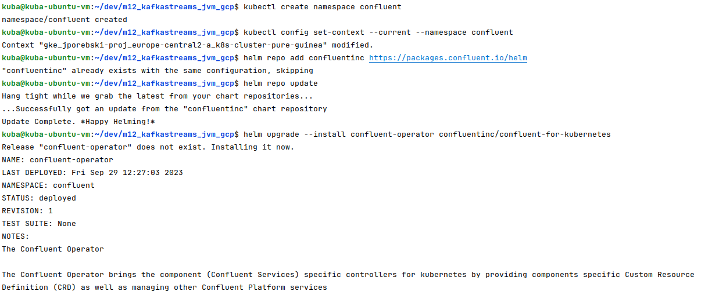
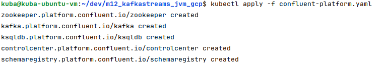
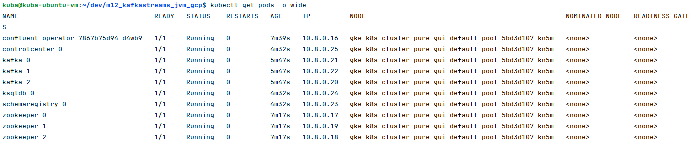
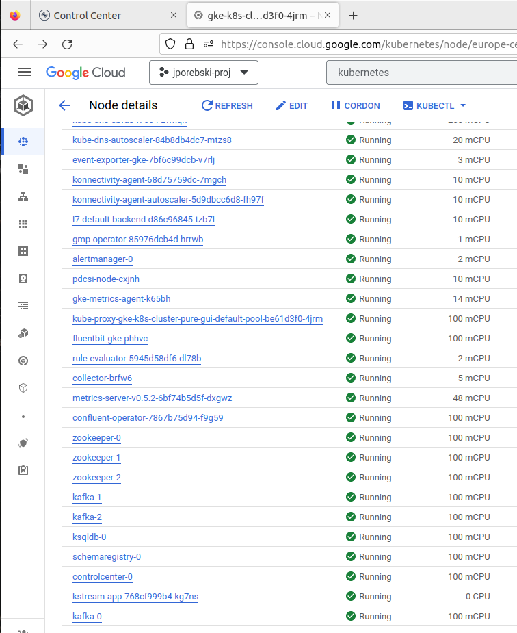
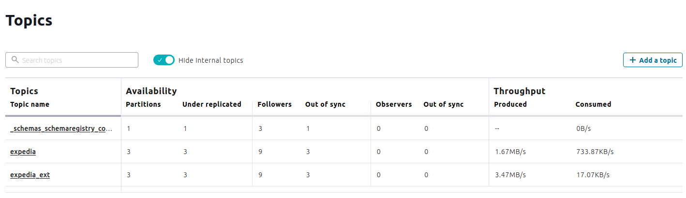
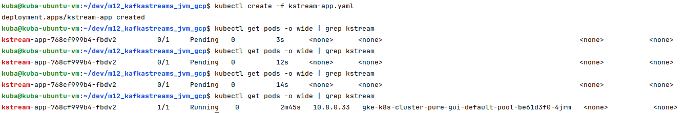
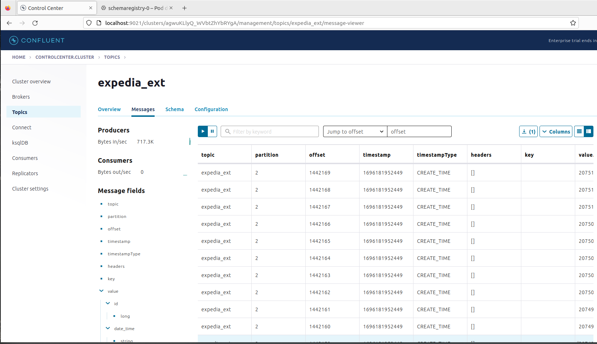

# Kafka Streams homework

## Configuration
* I didn't use Kafka Connect, I wrote my own connector-like class which is reading data from a GCP bucket and storing it into a Kafka topic.
* You will need to specify __following environment variables__ for connecting to a GCP bucket:
  * `BUCKET_NAME` - name of an existing GCP bucket, where homework data is already uploaded,
  * `DATA_DIR` - path to `expedia` topic data folder - inside aforementioned GCP bucket (e.g. _m12kafkastreams/topics/expedia/_). This folder is expected to have `partition=n` subfolders (where _n_ is some number),
  * `GOOGLE_APPLICATION_CREDENTIALS` - path to a GCP Service Account key file. It is required to retrieve data from a GCP bucket.
* Another useful environment variables used by the app:
  * `BOOTSTRAP_SERVER` - location of a kafka cluster, e.g. `kafka:9092`,
  * `SCHEMA_REGISTRY_URL` - full URL of a Schema Registry, e.g. `http://localhost:8081`.

## Steps to recreate
* Build the application using `mvn package`.
* Copy your service account key json file into the root directory of this project.
* Create docker image using `Dockerfile` in the root directory of this project.

### Running locally
* Make sure you have Zookeeper, Kafka, and Confluent Schema Registry running already. You can use existing `docker-compose-kafka-minimal.yml` file to build a minimal required local env for this task:
```
docker-compose -f docker-compose-kafka-minimal.yml up -d
```
* Run the container:
``` 
docker run --rm --name qstreams --network host  -it [dockerimagename]
```

### Running in the cloud
* It's important to do things according to the OLD_README.md file, which includes following steps.
* Prepare GCP using terraform by going to the `terraform` directory and executing `terraform init && terraform plan -out tf.plan && terraform apply tf.plan`.
* Configure your local CLI tools to work in provisioned via terraform infrastructure.
* Results should look like this:





* Screen below shows pods running:



* What it looks like in the GCP console?



* We have to create topics now. Let's do it via Confluent Control Center UI:



* We should now configure `kstream-app.yaml` and update various values, 
    and we must not forget about environment variables containing locations of Kafka Cluster and Schema Registry.
* When we run `kubectl apply -f kstream-app.yaml`, there should be another pod created:



* After a while, we can see the results. We need to go to Confluent Control Center, get into the `expedia_ext` topic and look at its data:



* And done!
